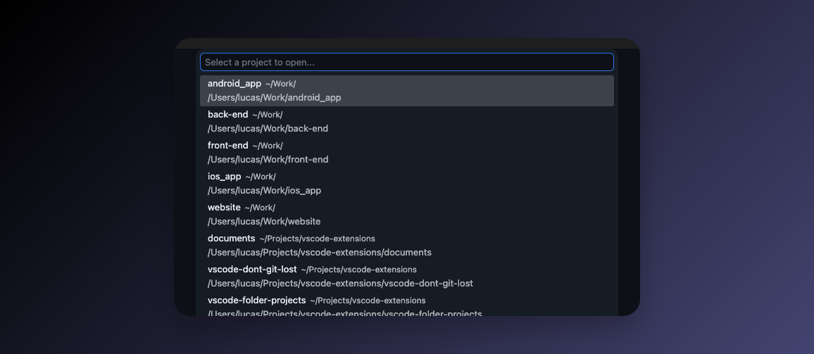
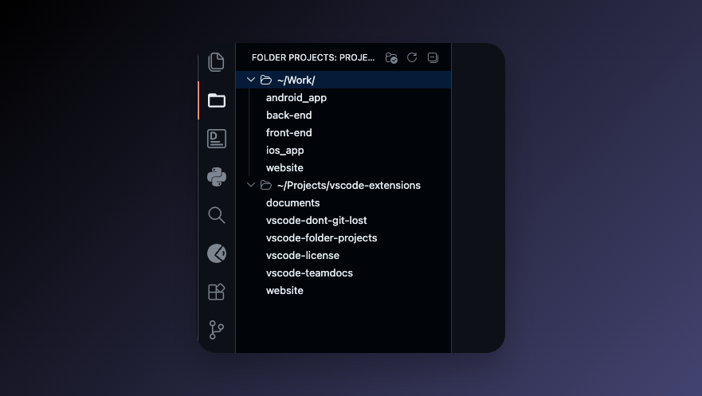

# Folder Projects

[Folder Projects](https://marketplace.visualstudio.com/items?itemName=lucasprag.folder-projects&ssr=false#overview) turns your directory structure into a project list — configure a few root directories and every subdirectory instantly becomes a project you can jump to.

No manual project registration. No stale lists. Just point it at where you keep your code and switch between projects in seconds.

## Features

### 1. Switch projects instantly

Run **`Folder Projects: List Projects to Open`** from the command palette to get a fuzzy-searchable list of every project across all your root directories.

- Each item shows the **project name**, the **root it belongs to**, and its **full path**.
- Select one and VS Code opens that folder immediately.

### 2. Browse projects from the Activity Bar

A dedicated **Folder Projects** icon is added to the Activity Bar. Click it to see all your projects organized by root directory.

- Root directories are listed as collapsible sections.
- Click any project to open it in VS Code.
- Use the refresh button in the view header to re-scan your roots after adding new folders.

### 3. Zero registration required

There's no list to maintain. Add a new folder inside one of your roots and it shows up automatically the next time you open the picker or refresh the view.

### 4. Ignore what you don't need

Use the `folderprojects.ignore` setting to filter out folders you never want to see as projects — hidden directories, build artifacts, archived work, and so on.

## Commands

| Command | Description |
| --- | --- |
| `Folder Projects: List Projects to Open` | Open a quick pick to fuzzy-find and switch to any project. |
| `Folder Projects: Refresh` | Re-scan all root directories and update the tree view. |
| `Folder Projects: Open Settings` | Jump straight to the Folder Projects configuration. |

## Extension Settings

| Setting | Description |
| --- | --- |
| `folderprojects.roots` | List of root directories to scan. All immediate subdirectories become projects. Supports `~` and environment variables. Example: `["~/Projects", "~/Work"]`. |
| `folderprojects.ignore` | Glob patterns for folders to exclude. Patterns without `/` match against the folder name; patterns with `/` match against the full path. Example: `[".*", "node_modules", "*/archived"]`. |

If `folderprojects.roots` is empty, Folder Projects will prompt you to configure it on activation.

## Getting started

1. Install **Folder Projects** from the Marketplace.
2. Open VS Code settings and add your root directories to `folderprojects.roots` — for example `["~/Projects"]`.
3. Run **`Folder Projects: List Projects to Open`** from the command palette — or click the **Folder Projects** icon in the Activity Bar.
4. Select a project and you're there.

## Free to use — supported by you

**Folder Projects is free.** It's MIT-licensed and fully functional out of the box, with no feature gating.

After a 14-day grace period, a polite popup appears about once a month asking you to support continued development with a **one-time license purchase**:

- One-time payment, lifetime use, unlimited devices
- One license stops the popup permanently
- Your license helps fund bug fixes, VS Code API updates, and new features

The cadence is intentional: this model **relies on long-term value building, not short-term annoyance**. If the extension is genuinely useful to you, you'll feel like supporting it. If it isn't, you've lost nothing — keep using it for free.

If you find Folder Projects useful in your daily work, please consider buying a license — it's the only way the project stays maintained.

---

## Check out my other extensions

Folder Projects is one of a few VS Code extensions I build and maintain. You can find the full list — along with the projects and articles I'm working on — at [lucasprag.com](https://lucasprag.com/).

---

## Support

Found a bug, have a feature idea, or just want to say hi? Reach out at:

&#108;&#117;&#99;&#97;&#115;&#112;&#114;&#97;&#103;&#46;&#112;&#114;&#111;&#106;&#101;&#99;&#116;&#115;&#32;&#91;&#97;&#116;&#93;&#32;&#103;&#109;&#97;&#105;&#108;&#32;&#91;&#100;&#111;&#116;&#93;&#32;&#99;&#111;&#109;

(replace `[at]` with `@` and `[dot]` with `.`)

---

## License

[MIT](LICENSE).
